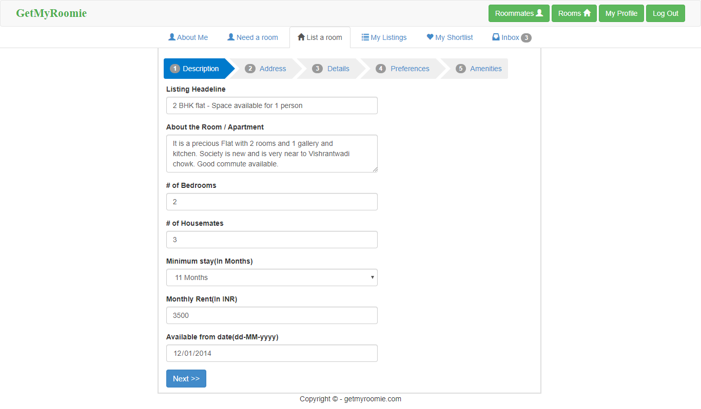

# GetMyRoomie
GetMyRoomie can be used to find roommates.

### Tech stack used
Spring,
Google Datastore
Google App engine
Twitter Bootstrap

### Deployed to Google App Engine - 
http://getmyroomie.appspot.com/

### Features
	1. Register, Login, Change Password
	2. Email Notifications
	3. Add Room listing
	4. Add Roommate listing
	5. My Shortlisting - Mark favorites
	6. My Listings Activate/Deactivate
	7. Send private messages to inbox in GetMyRoomie
	8. Search room or roommates
	9. Share listing on Facebook
	10. View listings in greate way.
	11. Google analytics
	12. Goole SEO
	13. Google WebMaster
	14. Facebook SEO

### How to run
Just import code in eclipse as Google Web Application. Create an app in Google App Engine and replace app id in WEB-INF/appengine-web.xml
Deploy code to Google App engine.

Take a look at -- http://YOUR_APP_ID.appspot.com/

### Screens

#### Home

#### Browse Roommates

#### Browse Rooms

#### Post ads

#### Profile

#### Need aroom ad

#### List a room ad

#### My Listings

#### Inbox

